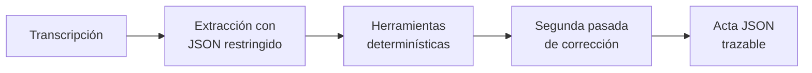

# Actas verificables desde transcripciones ruidosas

> Proyecto semestral · Inteligencia Artificial Generativa (580694) · Universidad de Concepción · Primavera 2026

[](#entregable-2)
[](#modelo-e-intervención)
[](https://github.com/benjaminnalvear-dev/genai-vio-meeting-minutes/actions/workflows/tests.yml)
[](#reproducción)

Sistema que transforma reuniones en español en actas JSON estructuradas y trazables. Cada decisión y tarea conserva una referencia a la intervención que la respalda; además, el flujo identifica cambios de decisión, responsables, plazos, condiciones y asuntos pendientes.

## Entregable 2

| Recurso | Contenido |
|---|---|
| [Documento técnico (PDF)](./Deliverable_2.pdf) | Resumen vertical de una página requerido para la entrega |
| [Fuente LaTeX](./Deliverable_2_BA_XG_ER_DV.md) | Código LaTeX reproducible del documento técnico |
| [Notebook principal](./GenAI%20Constrained%2BTool%20use/Ministral_Minutas_Colab.ipynb) | Ejecución end-to-end en Google Colab con GPU T4 |
| [Resultados completos](./GenAI%20Constrained%2BTool%20use/minutas_resultados_test.zip) | Salidas de las tres condiciones y métricas agregadas |
| [Descripción del experimento](./GenAI%20Constrained%2BTool%20use/README.md) | Diseño, entorno, resultados, limitaciones y pasos detallados |
| [Ablaciones y tool use por bloques](./experimentos/rag_tool_use/README.md) | Experimentos complementarios sobre el caso canónico de D1 |

### Resultado principal

Se evaluaron las tres configuraciones sobre las mismas **10 reuniones de test**: 347 intervenciones, 56 decisiones y 53 tareas de referencia.

| Configuración | JSON válido | F1 decisiones | F1 tareas | Tiempo total |
|---|---:|---:|---:|---:|
| Prompt directo (baseline) | 0/10 | 0,477 | 0,667 | 303,8 s |
| Constrained decoding | 10/10 | 0,559 | 0,709 | **197,9 s** |
| **Constrained decoding + herramientas** | **10/10** | **0,667** | **0,716** | 288,0 s |

La intervención completa elevó el F1 de decisiones en **39,8 %** y el F1 de tareas en **7,3 %** respecto del baseline. También pasó de 70/75 referencias existentes a 105/105. Esta última métrica valida la existencia del ID, no necesariamente que la evidencia sea semánticamente suficiente.

## Modelo e intervención

Se eligió **Ministral 3 3B Instruct 2512**, cuantizado en Q4_K_M y ejecutado mediante Ollama. Es el candidato más pequeño evaluado y puede correr en una GPU Tesla T4 de 15 GB.

El sistema combina dos técnicas:

1. **Constrained decoding:** un esquema restringe las claves, tipos, estados y estructura de la salida JSON.
2. **Herramientas determinísticas:** funciones locales inspeccionan la evidencia, resuelven fechas relativas, detectan indicios de revisión y validan IDs y formatos. El modelo recibe esos informes y corrige su primer borrador.



Los pesos del modelo no se modifican. El código Python coordina todas las etapas.

## Reproducción

La ruta recomendada reproduce el experimento agregado de 10 reuniones informado en el documento técnico.

### Opción A · Google Colab (recomendada)

1. Abra el [notebook principal en Google Colab](https://colab.research.google.com/github/benjaminnalvear-dev/genai-vio-meeting-minutes/blob/main/GenAI%20Constrained%2BTool%20use/Ministral_Minutas_Colab.ipynb).
2. Seleccione **Entorno de ejecución → Cambiar tipo de entorno de ejecución → GPU T4**.
3. Ejecute todas las celdas en orden.
4. Cuando el notebook lo solicite, cargue [`Fine Tuning.zip`](./GenAI%20Constrained%2BTool%20use/Fine%20Tuning.zip). El nombre es histórico: el experimento **no realiza fine-tuning**.
5. Espere la descarga del modelo y la ejecución de las 10 reuniones.
6. Compare `baseline`, `structured` y `combined_v2` en el archivo `summary.json` generado.

El notebook instala el entorno, descarga el modelo, ejecuta las tres configuraciones, calcula las métricas y exporta las salidas. El tiempo depende de la disponibilidad de Colab y de la descarga inicial del modelo.

### Compilar el documento técnico

Con MiKTeX/TeX Live y Poppler disponibles:

```powershell
powershell -NoProfile -ExecutionPolicy Bypass -File .\scripts\build_deliverable2.ps1
```

El script compila el fuente LaTeX, reemplaza `Deliverable_2.pdf` y falla si el resultado no tiene exactamente una página.

### Opción B · Pipeline experimental local

Requisitos: Python 3.10 o posterior, [Ollama](https://ollama.com/) activo y el modelo descargado.

```bash
ollama pull ministral-3:3b
cd experimentos/rag_tool_use
python run.py acta ejemplos/feria_colegio_formato_simple.md
```

Para comparar el baseline y todas las ablaciones sobre el caso canónico:

```bash
cd experimentos/rag_tool_use
python run.py todo
```

> La opción local corresponde al banco de ablaciones y a la comprobación del formato completo de D1. No es la misma corrida que produce la tabla agregada de 10 reuniones; esa tabla se reproduce con el notebook de Colab.

## Pruebas automáticas

Las pruebas no requieren Ollama ni conexión a internet. Validan el parser de transcripciones, el resolutor temporal, el evaluador y la selección de contexto para reuniones largas.

```bash
cd experimentos/rag_tool_use
python -m unittest discover -s tests -v
```

Estado verificado: **13/13 pruebas aprobadas**. Estas pruebas cubren el pipeline modular complementario de `experimentos/rag_tool_use`; el notebook oficial de 10 reuniones contiene su implementación y evaluador dentro del propio cuaderno.

## Caso de falla conocido

En la reunión M01, la solución genera JSON válido y referencias existentes, pero todavía mezcla información semántica entre intervenciones cercanas: interpreta «antes de las seis» como 17:00 al combinar la hora de envío con la hora de revisión, fusiona dos tareas y clasifica incorrectamente una fecha reemplazada.

La causa es concreta: las herramientas verifican sintaxis, fechas e IDs, pero la relación entre una cita y cada campo todavía depende del modelo. La segunda pasada puede heredar omisiones del borrador inicial. El [documento técnico](./Deliverable_2.pdf) detalla este caso y las demás limitaciones.

## Estructura del repositorio

```text
.
├── README.md                         # Punto de entrada y reproducción
├── Deliverable_2.pdf                 # Documento técnico final, una página
├── Deliverable_2_BA_XG_ER_DV.md      # Fuente LaTeX del documento
├── GenAI Constrained+Tool use/       # Experimento oficial sobre 10 reuniones
│   ├── Ministral_Minutas_Colab.ipynb
│   ├── Fine Tuning.zip               # Dataset; no implica entrenamiento
│   ├── minutas_resultados_test.zip
│   └── README.md
├── experimentos/rag_tool_use/        # Ablaciones y pipeline modular
│   ├── src/                           # Extracción, retrieval, fechas y evaluación
│   ├── tests/                         # 13 pruebas unitarias
│   ├── resultados/                    # Corridas auditables en T4 y Apple M5
│   ├── notebooks/d2_colab.ipynb
│   └── README.md
├── pruebas/                           # Fixture canónico, gold y auditorías de D1
├── Deliverable 1/                     # Documentación del primer entregable
└── scripts/                           # Baseline y evaluación originales
```

Los JSON oficiales conservan respuestas crudas, salidas procesadas, informes de herramientas, tiempos y conteos de tokens. Los prompts y el evaluador están versionados en el notebook que produjo esos archivos.

## Continuidad con el Entregable 1

El proyecto conserva la tarea y el criterio de corrección definidos en D1: no confundir propuestas con acuerdos, seguir decisiones reemplazadas, no asignar tareas a personas ausentes, resolver plazos y exigir evidencia textual. La evaluación agregada de 10 reuniones mide el núcleo de decisiones y tareas con un esquema reducido; el formato completo de D1 se evalúa por separado sobre el caso canónico. Esta diferencia se declara para no presentar el benchmark reducido como si cubriera todos los campos de D1.

## Video de demostración

El guion reproducible de menos de tres minutos está en [`VIDEO_D2.md`](./VIDEO_D2.md). La grabación debe realizarse sobre el commit final y publicarse con acceso abierto; no se incluye una simulación ni una salida hardcodeada.

Documentación histórica: [D1 en español](./Deliverable%201/Deliverable_1_BA_XG_ER_DV_ESPA%C3%91OL.md) · [D1 en inglés](./Deliverable%201/Deliverable_1_BA_XG_ER_DV.md)

## Equipo

- Benjamin Alvear
- Xavier Godoy
- Eduardo Ruiz
- Damian Vera

---

**Curso:** Inteligencia Artificial Generativa (580694) · **Entrega:** 30 de septiembre de 2026
